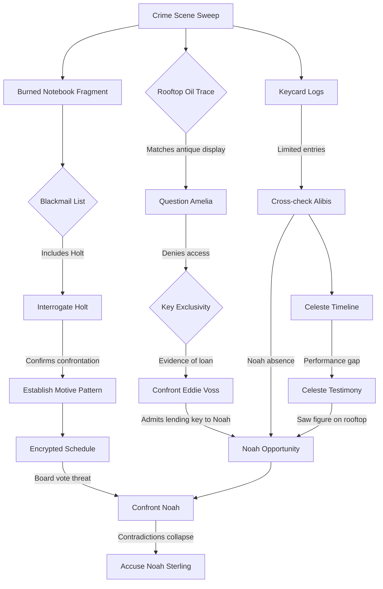

# Echoes in the Atrium — Complete Story Bible

## Overview

- **Title:** Echoes in the Atrium
- **Setting:** The Lyric Atrium Hotel, a refurbished 1920s art deco landmark in a dense downtown district
- **Date:** Friday, November 15, 2024
- **Event:** An exclusive tech-meets-jazz fundraiser gala featuring the unveiling of the Panopticon surveillance platform
- **Victim:** Julian Mercer — charismatic venture capitalist, majority owner of the Lyric Atrium Hotel, and CEO of the Panopticon surveillance startup
- **Crime:** Mercer found dead in the rooftop observatory at approximately 11:44 PM, bludgeoned with an antique telescope mount
- **Time of Death:** Between 11:15 and 11:30 PM (during a 15-minute power outage)
- **Murderer:** Noah Sterling
- **Themes:** Privacy vs. control, the cost of ambition, loyalty under pressure, and the ethics of innovation

---

## The Setting: Lyric Atrium Hotel

The Lyric Atrium Hotel is a refurbished 1920s art deco landmark. Originally a grand jazz-era hotel, it fell into disrepair until Julian Mercer's holding company funded its restoration, giving Mercer a majority ownership stake. The renovation preserved the hotel's period character: brass fixtures, geometric tile work, chevron moldings, and a soaring central atrium. Mercer's investment is why the Panopticon gala was hosted here — and why he had the authority to negotiate a sale of the property.

### Basement Level (B1) — Service & Maintenance

| Location | Code | Description |
|----------|------|-------------|
| **Maintenance Room** | — | Houses the main electrical breaker panel, HVAC controls, and plumbing manifolds. Access requires a **physical maintenance-room key** (not a keycard) held exclusively by the Head Engineer. The Head Engineer also carries an **engineering keycard** (ENGR-0001) that grants staff-level electronic access to the service elevator, freight elevator, rooftop stairwell, and restricted service areas. Both items live on the Head Engineer's work lanyard. A single steel door opens from the Utility Corridor. Lockpick marks were found on this door after the murder. |
| **Utility Corridor** | UTIL-CORR | Runs the length of the basement connecting the maintenance room, storage areas, and the service elevator shaft. Dimly lit even under normal power; emergency lighting barely reaches here. |
| **Service Elevator** | SVC-ELEV | A freight-sized elevator connecting B1 to every floor up to the rooftop. Used by staff for deliveries and equipment. Keycard required. |
| **Incinerator Room** | — | Adjacent to the maintenance room. Contains the hotel's gas-fed legacy incinerator (manual pilot ignition; does not require electrical power), now used for secure document destruction. The burned notebook fragment was recovered here. |
| **Staff Locker Room & Break Area** | — | Staff facilities. |

### Ground Floor (1F) — Public Spaces

| Location | Code | Description |
|----------|------|-------------|
| **Main Lobby** | LOBBY-MAIN | Grand double-height entrance with original terrazzo floors, an art deco reception desk, and a restored brass-cage elevator. Opens directly into the central atrium. |
| **Staff Entrance** | LOBBY-STAFF | Side door used by employees, accessible from the alley. Keycard required. |
| **The Atrium** | — | A five-story open-air interior courtyard at the hotel's center. A geometric glass skylight crowns the top. Balconied mezzanines on each floor overlook the ground-level garden court below. During the gala, decorated with vintage microphones and projected surveillance-art installations referencing Panopticon's themes. |
| **Kitchen & Prep Area** | KITCHEN | Serves both the ballroom and the VIP bar. Connected to the ballroom service corridor. |
| **Atrium Stairwell** | ATRIUM-STAIR | A grand open staircase winding up through the central atrium, with landings on each mezzanine level from the ground floor to the 7th floor. Visible from the balconied mezzanines. During the blackout, this was the main route between floors for anyone avoiding the elevators. |

### Second Floor (2F) — Event Spaces

| Location | Code | Description |
|----------|------|-------------|
| **Grand Ballroom** | BALL-MAIN | The primary gala venue. Seats 200 guests. A raised stage at the north end was used for the Panopticon keynote demo and speeches. The Ballroom Service Corridor (BALL-SVC) runs along the south wall, linking the kitchen to the ballroom for catering. |
| **Backstage Area** | BSTAGE | Dressing rooms, a lighting/sound console operated by the stage manager, green room, and a corridor leading to the service elevator and freight elevator. |
| **Speakeasy Lounge** | SPEAK-LOUNGE | An intimate, low-ceilinged jazz club styled after a 1920s speakeasy. Located off the atrium mezzanine on the second floor. Celeste Ward performed here. A small stage, cocktail tables, and a secondary bar. |
| **VIP Bar & Lounge** | VIP-BAR | An exclusive bar adjacent to the speakeasy, tended by Eddie Voss during the gala. Separated by a velvet rope. Mercer spent time here during the evening. |

### Third Floor (3F) — Conference & Library

| Location | Code | Description |
|----------|------|-------------|
| **Hotel Library** | LIBR-MAIN | A wood-paneled reading room with leather armchairs and floor-to-ceiling bookshelves. Dr. Mira Kline hosted her ethics roundtable here. A private study room in the back can be reserved. |
| **Conference Room 2** | CONF-2 | A smaller meeting room used for private conversations and press briefings during the gala. |
| **Security Command Center** | CMD-CTR | The nerve center for hotel surveillance. Banks of monitors display feeds from CCTV cameras throughout the property. Gideon Holt's base of operations. Located in a restricted wing of the third floor with reinforced door and keycard access. |

### Floors 4–6 — Guest Rooms

Standard guest rooms. Not directly relevant to the case.

### Floor 7 (7F) — VIP Suites

| Location | Code | Description |
|----------|------|-------------|
| **Guest Floor 7** | GUEST-7F | Premium suites reserved for gala VIPs. Julian Mercer occupied **Suite 701**; Noah Sterling occupied **Suite 703**. Each suite has a private balcony overlooking the atrium skylight. Keycard access required for the floor. |

### Rooftop (8F) — Observatory & Access

| Location | Code | Description |
|----------|------|-------------|
| **Rooftop Observatory** | ROOF-OBS | A glass-enclosed observation deck with panoramic city views. Contains a collection of antique astronomical instruments, including the **telescope mount** used as the murder weapon. The telescope mount was a brass and iron Victorian-era piece weighing approximately 8 kg, displayed on a mahogany pedestal. It sat in a shallow brass cradle — secured by its own weight, no bolts — and could be lifted with one hand. Mercer's body was found here at approximately 11:44 PM by Security Director Gideon Holt. |
| **Rooftop Stairwell** | ROOF-STAIR | An enclosed staircase connecting the 7th floor to the rooftop. Keycard-controlled fire door at the top. |
| **Freight Elevator** | FRT-ELEV | A large cargo elevator with stops at B1, 1F, 2F, and the rooftop. Keycard required. Noah was seen near this elevator by Priya Shah before the blackout. |

### Security & Surveillance

- **CCTV cameras** cover: the lobby, ballroom entrances, elevator lobbies on each floor, the rooftop stairwell door, and the command center corridor.
- **Cameras do NOT cover:** the interior of guest rooms, the speakeasy lounge interior, the backstage area, the maintenance room, or the utility corridor in B1.
- **Keycard readers** are installed at every zone transition point. They log card ID, holder name, zone, direction (entry/exit), and timestamp.
- **During the power outage (11:15–11:30 PM):** ALL keycard readers went offline. The backup generator failed to engage primary access control, meaning doors with electronic locks defaulted to **unlocked** during the outage. Physical-key locks (e.g., the maintenance room) remained locked.
- **Tailgating:** Keycard readers log only the card swiped, not the number of people who pass through the door. Multiple people can enter on a single swipe. The logs prove a card was used at a time and place, but do not prove the cardholder was the only person who entered — or even that the cardholder was the one who swiped.
- **Panopticon Demo:** Mercer's keynote included a live demo of the Panopticon surveillance platform, which briefly accessed the hotel's own CCTV feeds to show real-time facial recognition and behavioral analytics.

### Key Routes During the Blackout

1. Backstage (2F) → Service elevator → B1 Utility Corridor → Maintenance room (if they had the physical key)
2. Backstage (2F) → Freight elevator → Rooftop
3. VIP Bar (2F) → Main corridor → Atrium stairs → 7F → Rooftop stairwell
4. Library (3F) → Main corridor → Atrium stairs → up or down
5. Any floor → Service elevator → any other floor (no keycard needed during outage)

During the 15-minute blackout, electronic locks were unlocked, so movement between zones left **no keycard trace**.

---

## Persons of Interest

### 1. Detective Lila Chen — Partner & Compliance Monitor

| | |
|---|---|
| **Role** | Player's partner and assistant detective |
| **Gender** | Female |
| **Archetype** | Professional Fixer |
| **Voice** | Nova |
| **Personality** | Pragmatic, tech-savvy, direct and to the point — dry humor, no fluff. Cuts through noise with a wry aside. |

**Context & Knowledge:**
- Witnessed the aftermath of Julian Mercer's murder at the Lyric Atrium Hotel
- Forensics recovered a burned notebook fragment in the incinerator and traces of antique machine oil near the body
- Hotel security provided keycard access logs for the rooftop
- The power outage was caused by someone manually pulling the breaker in the maintenance room
- Has access to official reports, forensic updates, surveillance summaries, and departmental regulations

**Hidden Truth:**
- Secretly reporting to Internal Affairs about the player's conduct
- Will not admit this unless cornered with irrefutable proof

**Crime Scene Findings (shared with player):**
- Body found near window wall of the rooftop observatory
- Smashed telescope mount identified as the murder weapon
- Antique machine oil traces near the body and on the weapon
- Burned notebook fragment recovered from basement incinerator (names visible, including "G. Holt")
- Rooftop keycard log shows only 4 entries after 10 PM
- Lockpick marks on the maintenance room door
- Power outage caused by manual breaker pull

---

### 2. Amelia Reyes — Head Engineer

| | |
|---|---|
| **Role** | Head Engineer of the Lyric Atrium Hotel |
| **Gender** | Female |
| **Archetype** | Professional Fixer |
| **Voice** | Shimmer |
| **Personality** | Precise, prideful, loyal to hotel heritage, dislikes Mercer's modernization plans. Talks like someone who's been fixing things her whole life — practical, a little impatient, not fancy. |

**Public Story:**
- Was calibrating server racks in the ballroom when the power outage occurred
- Insists her maintenance-room key and engineering keycard never left her possession
- Sees Mercer as a threat to the hotel's legacy

**Hidden Truth:**
- Lent her work lanyard — which holds both her physical maintenance-room key and her engineering keycard (ENGR-0001) — to Eddie Voss (~6:30 PM) so he could retrieve a misplaced toolkit
- After discovering documents showing Mercer intended to sell the hotel to a developer (8:36 PM maintenance visit), she planned to search Mercer's suite for proof
- **Pulled the breaker** at 11:15 PM to cause the blackout, then searched Suite 701 during the outage
- Had to pick the lock on the maintenance door because her key was still with Eddie
- Did NOT kill Mercer
- Fears losing her position if the key and keycard loan is exposed

**Where Her Story Breaks:**
- Key and keycard loan to Eddie contradicts claim of exclusive possession
- Lockpick marks on maintenance door
- Keycard shows ballroom entry at 11:32 PM (after power restored, not during outage as claimed)
- Hotel sale documents provide motive for the blackout

**Personal Timeline:**
| Time | Location | Activity |
|------|----------|----------|
| 5:31 PM [KC] | Staff Entrance | Arrives |
| 5:32 PM [KC] | Maintenance Level | Pre-event diagnostics |
| 6:04 PM [KC] | Grand Ballroom | Inspects AV systems |
| ~6:30 PM | — | Lends work lanyard (maintenance-room key + engineering keycard ENGR-0001) to Eddie |
| 8:36 PM [KC] | Maintenance Level | Routine check; discovers hotel sale documents |
| 8:48 PM [KC] | — | Exits maintenance |
| 10:06 PM [KC] | Maintenance Level | Plans suite search |
| 10:15 PM [KC] | — | Exits maintenance |
| 10:17 PM [KC] | Grand Ballroom | Establishes alibi near server racks |
| ~11:15 PM | Maintenance Room | Picks lock, pulls breaker |
| ~11:17 PM | Guest Floor 7 | Reaches Suite 701 via main stairwell |
| ~11:20 PM | Suite 701 | Searches for sale documents |
| ~11:27 PM | — | Leaves Suite 701, heads down via main stairwell |
| ~11:29 PM | Maintenance Level (B1) | Reaches B1 en route to ballroom; resets the main breaker |
| ~11:31 PM | — | Continues upward to ballroom level |
| 11:32 PM [KC] | Grand Ballroom | Re-enters (after power restored) |
| 11:39 PM [KC] | Maintenance Level | Returns to inspect systems and cover her tracks (verify breaker position, check for evidence) |
| 11:50 PM [KC] | — | Exits maintenance |

---

### 3. Noah Sterling — Co-Founder (THE MURDERER)

| | |
|---|---|
| **Role** | Co-Founder of Panopticon |
| **Gender** | Male |
| **Archetype** | Proud Executive |
| **Voice** | Onyx |
| **Personality** | Smooth, charming, used to talking his way out of things. Under the surface he's desperate — debt, a looming board vote. Keep it breezy. |

**Public Story (Cover Story / Lies):**
- Claims he was on stage delivering a keynote demo when the outage hit
- Says he stayed with the guests to calm them during the blackout
- Presents himself as loyal to Mercer and shocked by his death
- Claims conversation with Mercer at VIP bar was "friendly"
- Claims he never went to the service levels or basement
- Claims he never obtained any maintenance keys or keycards

**Hidden Truth (What Actually Happened):**
- Embezzled company funds to cover gambling debts
- Mercer discovered the embezzlement and scheduled a surprise board vote to remove him
- Pressured Eddie Voss into giving him Amelia's engineering keycard (ENGR-0001) and physical maintenance-room key at the VIP bar around 10:40 PM
- During the blackout, used the engineering keycard to reach the rooftop observatory
- **Killed Mercer** by striking him with the antique telescope mount (~11:20 PM)
- Antique machine oil from the telescope mount transferred to his cufflinks (he did not notice)
- Took Mercer's notebook containing the blackmail list and board vote evidence
- Descended via rooftop stairwell to 7th floor, then took the atrium stairwell down (Celeste Ward saw him passing the 2nd-floor mezzanine at ~11:23 PM). Continued to B1 and fed the notebook pages into the incinerator (burn was incomplete; a fragment survived)
- Made his way back to the ballroom to be seen by other guests

**Where His Lies Break:**
1. "I remained backstage/ballroom" — Keycard logs show ENGR-0001 at freight elevator (11:09 PM), service elevator B1 (11:13 PM), utility corridor exit (11:31 PM)
2. "Conversation with Mercer was friendly" — Eddie Voss and other witnesses describe tension
3. "Never went to service levels" — Keycard log 11:31 PM: ENGR-0001 exiting Utility Corridor B1
4. "Never obtained any keys or keycards" — Eddie Voss testimony, keycard ENGR-0001 chain of custody
5. "Shocked by Mercer's death" — Board vote motive, embezzlement evidence, encrypted schedule

**Progression Under Pressure:**
Deny everything → Explain away keycard logs as "got lost" → Deny key → Admit "disagreements" with Mercer → Claim self-defense or accident

**Actual Timeline:**
| Time | Location | Activity |
|------|----------|----------|
| 7:10 PM [KC] | Main Lobby | Arrives |
| 7:11 PM [KC] | Suite 703 | Checks in |
| 7:32 PM [KC] | Grand Ballroom | Joins gala |
| 8:00 PM [KC] | Backstage | Prepares for keynote |
| ~8:10 PM | Grand Ballroom stage | Keynote demo with Mercer (~45 min) |
| ~8:55 PM | Backstage | Returns after keynote |
| 10:34 PM [KC] | — | Exits backstage |
| 10:37 PM [KC] | VIP Bar | Tense conversation with Mercer; pressures Eddie for lanyard (key + keycard) |
| **~10:40 PM** | **VIP Bar** | **Obtains engineering keycard (ENGR-0001) and maintenance-room key from Eddie** |
| 10:50 PM [KC] | Grand Ballroom | Makes brief appearance |
| 10:52 PM [KC] | Backstage | Returns |
| 11:09 PM [KC] | Freight Elevator | Uses ENGR-0001; heads toward B1 |
| 11:13 PM [KC] | Service Elevator B1 | Uses ENGR-0001; ascending toward rooftop |
| ~11:17 PM | Rooftop Observatory | Enters; Mercer is there alone |
| ~11:18 PM | Rooftop Observatory | Confrontation about embezzlement and board vote |
| **~11:20 PM** | **Rooftop Observatory** | **Strikes Mercer with telescope mount — fatal blow** |
| ~11:21 PM | Rooftop Observatory | Wipes hands; oil transfers to cufflinks (unnoticed) |
| ~11:23 PM | Rooftop Stairwell → 7F → Atrium Stairwell | Descends with Mercer's notebook; Celeste sees him at 2F mezzanine |
| ~11:26 PM | Incinerator Room (B1) | Feeds notebook pages into incinerator (incomplete burn) |
| ~11:28 PM | Utility Corridor / Service Elevator | Makes way back toward ballroom |
| 11:31 PM [KC] | Utility Corridor B1 | Exits using ENGR-0001 (logged as "A. Reyes" — suspicious) |
| 11:33 PM [KC] | Service Elevator B1 | Uses ENGR-0001; ascending |
| 11:35 PM [KC] | Grand Ballroom | Mingles, makes himself visible |

**9 pieces of evidence that tie Noah to the murder:**
1. Keycard ENGR-0001: Freight elevator 11:09 PM (logged as "A. Reyes")
2. Keycard ENGR-0001: Service elevator B1 11:13 PM (logged as "A. Reyes")
3. Keycard ENGR-0001: Utility corridor exit 11:31 PM (logged as "A. Reyes")
4. Eddie's testimony: gave Noah the engineering keycard and maintenance-room key
5. Celeste's testimony: saw Noah descending stairwell during blackout
6. Antique oil on cufflinks
7. Burned notebook fragment in incinerator
8. Motive: embezzlement + board vote
9. Marcus's cue sheet: 5-minute (30-min total) absence from backstage

---

### 4. Celeste Ward — Jazz Vocalist & Secret Lover

| | |
|---|---|
| **Role** | Jazz vocalist performing at the gala |
| **Gender** | Female |
| **Archetype** | Anxious Insider |
| **Voice** | Alloy |
| **Personality** | Magnetic, emotionally guarded, adept at reading people. Keeps feelings close. Talks with quiet intensity — poetic sometimes, but never wordy. Think pauses and half-finished thoughts, not speeches. |

**Public Story:**
- Was performing in the speakeasy lounge throughout the outage and saw nothing
- Distances herself from corporate politics

**Hidden Truth:**
- Had a secret romantic relationship with Julian Mercer
- Mercer promised to free her from a predatory management contract; his death leaves her vulnerable and exposed
- **Saw a figure she recognized as Noah Sterling** descending the atrium stairwell during the blackout (~11:23 PM) — he appeared agitated and was adjusting his cuffs
- Possesses audio recordings of Mercer admitting to illegal surveillance tactics used in Panopticon
- Fears scandal if she speaks about what she saw

**Personal Timeline:**
| Time | Location | Activity |
|------|----------|----------|
| 7:15 PM [KC] | Main Lobby | Arrives |
| 7:16 PM [KC] | Backstage | Prepares for set |
| 7:44 PM [KC] | Speakeasy Lounge | First jazz set begins ~7:45 PM |
| ~9:47 PM | Speakeasy Lounge | Mercer visits during second set; private exchange about management contract |
| ~11:15 PM | Speakeasy Lounge | Lights go out mid-song |
| ~11:18 PM | Corridor/Mezzanine | Takes unscheduled break from stage |
| **~11:23 PM** | **2F Mezzanine** | **Sees Noah Sterling descending atrium stairwell — agitated, adjusting cuffs** |
| ~11:26 PM | Speakeasy Lounge | Returns to stage, resumes set |
| 11:34 PM [KC] | Speakeasy Lounge | Re-enters after break |

---

### 5. Gideon Holt — Security Director

| | |
|---|---|
| **Role** | Security Director of the Lyric Atrium Hotel |
| **Gender** | Male |
| **Archetype** | Professional Fixer |
| **Voice** | Echo |
| **Personality** | Stern, rule-bound, ex-military. Blunt, territorial, and doesn't like being told how to do his job. Short sentences. No small talk. |

**Public Story:**
- Coordinated emergency protocols during the outage and never left the command center
- Emphasizes his spotless record and loyalty to the hotel

**Hidden Truth:**
- Runs a side business selling anonymized guest data from the hotel's systems
- Mercer discovered this and was **blackmailing** him; Holt's name appears on the burned notebook fragment
- **Confronted Mercer** on the rooftop observatory earlier that evening (10:01–10:08 PM) but left before the murder
- Suspects Noah Sterling because he saw him on the B1 elevator lobby camera entering the service elevator lobby right before the blackout (~11:14 PM)

**Personal Timeline:**
| Time | Location | Activity |
|------|----------|----------|
| 5:35 PM [KC] | Security Command Center | Reviews feeds, positions staff |
| 9:23 PM [KC] | Grand Ballroom | Coordinates security for rooftop reception |
| **10:01 PM [KC]** | **Rooftop Observatory** | **Confronts Mercer about blackmail; heated but brief** |
| 10:08 PM [KC] | — | Exits observatory, shaken |
| 10:09 PM [KC] | Security Command Center | Returns |
| ~11:14 PM | Command Center | Sees Noah on B1 elevator lobby camera entering the service elevator lobby |
| 11:15 PM | Command Center | Monitors go dark; switches to emergency protocols |
| 11:31 PM [KC] | Command Center | Re-authenticates |
| **11:43 PM [KC]** | Rooftop Stairwell | Goes to investigate |
| **11:44 PM [KC]** | **Rooftop Observatory** | **Discovers Mercer's body** |
| 11:47 PM [KC] | Command Center | Radios for emergency services, initiates lockdown |

---

### 6. Dr. Mira Kline — Ethicist Consultant

| | |
|---|---|
| **Role** | Ethicist consultant hired by Mercer for public legitimacy |
| **Gender** | Female |
| **Archetype** | Proud Executive |
| **Voice** | Coral |
| **Personality** | Measured and precise — an academic who chooses words carefully. But there's a cold edge underneath. Doesn't ramble; makes points. |

**Public Story:**
- Was leading an ethics roundtable in the library during the outage; several attendees can confirm
- Advocates for responsible innovation and transparency

**Hidden Truth:**
- **Mercer plagiarized her research** for the Panopticon ethics framework
- Arranged for investigative journalist Priya Shah to attend the gala to expose him
- Scheduled a **private meeting with Mercer at 11:30 PM** to demand a public admission of plagiarism
- The meeting never happened — Mercer was already dead
- Left the roundtable briefly during the outage (~11:18–11:24 PM) to prepare documents

**Personal Timeline:**
| Time | Location | Activity |
|------|----------|----------|
| 7:20 PM [KC] | Main Lobby | Arrives |
| 8:24 PM [KC] | Hotel Library | Sets up for ethics roundtable |
| ~9:00 PM | Hotel Library | Roundtable begins (~15–20 attendees) |
| 11:11 PM [KC] | — | Briefly exits library |
| 11:12 PM [KC] | Hotel Library | Returns; preparing documents for 11:30 PM meeting |
| ~11:18 PM | Library back room | Steps away during blackout |
| ~11:24 PM | Hotel Library | Returns to roundtable |
| ~11:30 PM | — | Goes to meet Mercer; he never appears |

---

### 7. Eddie Voss — Junior Engineer

| | |
|---|---|
| **Role** | Amelia's engineering protege, tending the VIP bar tonight |
| **Gender** | Male |
| **Archetype** | Anxious Insider |
| **Voice** | Fable |
| **Personality** | Has real talent for engineering, but true passion is mixology. Jittery, people-pleaser, talks too much when nervous. Lots of "um"s and "I mean" and backtracking. |

**Public Story:**
- Tended the VIP bar during the outage and helped calm guests
- Insists he had no involvement with the maintenance wing

**Hidden Truth:**
- Amelia lent him her work lanyard — which holds both her physical maintenance-room key and her engineering keycard (ENGR-0001) — (~6:30 PM) to retrieve a misplaced toolkit; he forgot to return it
- **Noah Sterling pressured him** to hand over the lanyard (both items) at the VIP bar around 10:40 PM, promising favors
- Eddie complied out of fear of losing his job
- Glimpsed Noah heading toward the service elevator afterward

**Personal Timeline:**
| Time | Location | Activity |
|------|----------|----------|
| 6:34 PM [KC] | VIP Bar | Begins bar setup |
| ~6:30 PM | — | Receives Amelia's work lanyard (maintenance-room key + engineering keycard ENGR-0001); forgets to return it |
| ~10:20 PM | VIP Bar | Serves Mercer (who appears preoccupied) |
| ~10:37 PM | VIP Bar | Serves both Mercer and Noah (tense conversation) |
| **~10:40 PM** | **VIP Bar** | **Noah pressures Eddie; Eddie hands over the lanyard (maintenance-room key + engineering keycard)** |
| ~10:40 PM | VIP Bar | Sees Noah head toward service elevator |
| 11:15 PM | VIP Bar | Lights go out; lights candles, calms guests |
| — | VIP Bar | Stays at bar throughout blackout |

---

### 8. Priya Shah — Investigative Journalist

| | |
|---|---|
| **Role** | Investigative journalist covering corporate surveillance abuses |
| **Gender** | Female |
| **Archetype** | Professional Fixer |
| **Voice** | Sage |
| **Personality** | Sharp, skeptical, not intimidated by badges. Asks as many questions as answers. Confident but not arrogant — think seasoned reporter. |

**Public Story:**
- Attended the gala as invited press and took notes during the keynote
- Claims journalistic privilege regarding sources

**Hidden Truth:**
- Dr. Mira Kline tipped her off about Mercer's ethics violations and the upcoming board vote; Mira arranged her gala attendance
- **Witnessed Noah Sterling near the freight elevator** shortly before the lights went out (~11:09–11:13 PM) — odd for a VIP
- **Recorded audio snippets** of Mercer's argument with Gideon Holt earlier that evening from the rooftop stairwell
- Saving the recordings for publication leverage

**Personal Timeline:**
| Time | Location | Activity |
|------|----------|----------|
| 7:25 PM [KC] | Main Lobby | Arrives |
| 7:36 PM [KC] | Grand Ballroom | Attends gala |
| ~8:00–8:55 PM | Grand Ballroom | Observes keynote, takes notes |
| **~10:01 PM** | **Rooftop Stairwell** | **Follows Holt out of instinct; records audio of Mercer-Holt argument** |
| **~11:09–11:13 PM** | **2F corridor** | **Sees Noah near the freight elevator** |
| 11:15 PM | Grand Ballroom | Takes notes during blackout by phone flashlight |
| 11:55 PM [KC] | Grand Ballroom | Returns from independent investigation |

---

### 9. Marcus Vale — Stage Manager

| | |
|---|---|
| **Role** | Stage manager coordinating lighting and cues for the gala |
| **Gender** | Male |
| **Archetype** | Anxious Insider |
| **Voice** | Ash |
| **Personality** | Lives by his clipboard and cue sheets. Talks in specifics — times, positions, sequences. Not chatty, just precise. |

**Public Story:**
- Stayed backstage coordinating the show and managing lighting cues during the outage
- Portrays himself as neutral and focused on the production

**Hidden Truth:**
- **Noticed Noah Sterling slip away** from backstage — a 5-minute cue-sheet gap (11:05–11:10 PM) before the blackout, and roughly 30 minutes total absence before Noah reappeared at ~11:35 PM
- **Observed Celeste Ward taking an unscheduled break** from the speakeasy stage (~11:18 PM), suggesting she saw something
- Possesses lighting console logs that corroborate the timing gaps

**Personal Timeline:**
| Time | Location | Activity |
|------|----------|----------|
| 5:49 PM [KC] | Backstage | Stage setup, lighting checks, sound calibration |
| ~8:00–8:55 PM | Backstage | Manages keynote lighting/sound |
| ~9:00–11:00 PM | Backstage | Manages evening program |
| ~11:05 PM | Backstage | Notices Noah slip away (marks 5-min gap on cue sheet) |
| 11:15 PM | Backstage (lighting console) | Power cuts; notes exact time: 11:15:04 PM |
| ~11:18 PM | Backstage | Notes Celeste takes unscheduled break from speakeasy |
| — | Backstage | Remains throughout blackout |
| ~11:35 PM | Backstage | Noah reappears (30 min total absence) |
| 11:41 PM [KC] | — | Exits backstage; heard commotion about rooftop discovery |

---

## Master Timeline

All times on 2024-11-15 (Friday) unless noted as post-midnight. Keycard-confirmed entries marked **[KC]**.

### 5:30 PM — Setup Phase

| Time | Person | Location | Event |
|------|--------|----------|-------|
| 5:31 PM [KC] | Amelia Reyes | Staff Entrance | Arrives; proceeds to Maintenance Level (5:32 PM) |
| 5:35 PM [KC] | Gideon Holt | Command Center | Reviews camera feeds, positions staff |
| 5:49 PM [KC] | Marcus Vale | Backstage | Stage setup, lighting checks |
| 6:04 PM [KC] | Amelia Reyes | Grand Ballroom | Inspects AV systems and server racks |
| 6:34 PM [KC] | Eddie Voss | VIP Bar | Begins bar setup |

### ~6:30 PM — Amelia Lends Key to Eddie

Amelia gives Eddie her work lanyard — which holds both her physical maintenance-room key and her engineering keycard (ENGR-0001) — to retrieve a misplaced toolkit from storage near B1. She tells him to return it promptly. Eddie pockets the lanyard and gets distracted by bar prep; he forgets to return it.

### 7:00 PM — Guests Arrive

| Time | Person | Location | Event |
|------|--------|----------|-------|
| 7:07 PM [KC] | Julian Mercer | Main Lobby | Arrives |
| 7:08 PM [KC] | Julian Mercer | Suite 701 | Freshens up |
| 7:10 PM [KC] | Noah Sterling | Main Lobby | Arrives |
| 7:11 PM [KC] | Noah Sterling | Suite 703 | Checks in |
| 7:15 PM [KC] | Celeste Ward | Main Lobby | Arrives |
| 7:16 PM [KC] | Celeste Ward | Backstage | Prepares for set |
| 7:20 PM [KC] | Dr. Mira Kline | Main Lobby | Arrives |
| 7:25 PM [KC] | Priya Shah | Main Lobby | Arrives |

### 7:30 PM — Gala Begins

| Time | Person | Location | Event |
|------|--------|----------|-------|
| 7:30 PM [KC] | Mercer | Grand Ballroom | Opening remarks, mingles |
| 7:32 PM [KC] | Sterling | Grand Ballroom | Joins gala |
| 7:36 PM [KC] | Priya Shah | Grand Ballroom | Enters |
| 7:44 PM [KC] | Celeste Ward | Speakeasy Lounge | First jazz set begins ~7:45 PM |

### 8:00 PM — Keynote Demo

| Time | Person | Location | Event |
|------|--------|----------|-------|
| 8:00 PM [KC] | Sterling | Backstage | Prepares for keynote |
| ~8:10 PM | Sterling & Mercer | Ballroom Stage | Panopticon keynote demo (~45 min) |
| 8:24 PM [KC] | Dr. Kline | Hotel Library | Sets up ethics roundtable (9:00 PM start) |

### ~8:30 PM — Amelia's Maintenance Check

| Time | Person | Location | Event |
|------|--------|----------|-------|
| 8:36 PM [KC] | Amelia | Maintenance Level | Routine check; **discovers hotel sale documents** |
| 8:48 PM [KC] | Amelia | — | Exits maintenance, alarmed |

### ~9:00 PM — Evening Program

| Time | Person | Location | Event |
|------|--------|----------|-------|
| ~8:55 PM | Sterling | Backstage | Keynote concludes; returns backstage |
| ~9:00 PM | Dr. Kline | Hotel Library | Ethics roundtable begins (15–20 attendees) |
| 9:23 PM [KC] | Gideon Holt | Grand Ballroom | Coordinates security for rooftop reception |

### 9:30 PM — Rooftop Reception

| Time | Person | Location | Event |
|------|--------|----------|-------|
| 9:34 PM [KC] | Mercer | Rooftop Observatory | Reception opens; guests mingle |
| 9:45 PM [KC] | Mercer | — | Exits observatory |
| 9:47 PM [KC] | Mercer | Speakeasy Lounge | Visits Celeste during second set; private exchange about management contract |

### 10:00 PM — Holt Confronts Mercer

| Time | Person | Location | Event |
|------|--------|----------|-------|
| 10:01 PM [KC] | Gideon Holt | Rooftop Observatory | **Confronts Mercer about blackmail**; heated but brief |
| — | Priya Shah | Rooftop Stairwell | **Records audio snippets** of argument |
| 10:08 PM [KC] | Holt | — | Exits observatory, shaken |
| 10:09 PM [KC] | Holt | Command Center | Returns |

### ~10:00 PM — Amelia's Second Visit

| Time | Person | Location | Event |
|------|--------|----------|-------|
| 10:06 PM [KC] | Amelia | Maintenance Level | Plans suite search |
| 10:15 PM [KC] | Amelia | — | Exits |
| 10:17 PM [KC] | Amelia | Grand Ballroom | Establishes alibi near server racks |

### 10:20 PM — Mercer at VIP Bar

| Time | Person | Location | Event |
|------|--------|----------|-------|
| 10:20 PM [KC] | Mercer | VIP Bar | Has a drink; Eddie serves him. Mercer appears preoccupied (~40 min stay) |

### ~10:30 PM — Noah Moves to VIP Bar

| Time | Person | Location | Event |
|------|--------|----------|-------|
| 10:34 PM [KC] | Sterling | — | Exits backstage |
| 10:37 PM [KC] | Sterling | VIP Bar | Tense conversation with Mercer; **pressures Eddie for lanyard (key + keycard)** |
| **~10:40 PM** | Sterling | VIP Bar | **Obtains engineering keycard (ENGR-0001) and maintenance-room key from Eddie** |
| 10:50 PM [KC] | Sterling | Grand Ballroom | Brief appearance to be seen |
| 10:52 PM [KC] | Sterling | Backstage | Returns |

### 11:00 PM — The Critical Hour

| Time | Person | Location | Event |
|------|--------|----------|-------|
| 11:02 PM [KC] | Mercer | — | Exits VIP Bar |
| 11:06 PM [KC] | Mercer | Suite 701 | Retrieves something |
| **11:08 PM [KC]** | **Mercer** | **Rooftop Observatory** | **Enters for the last time** |
| 11:09 PM [KC] | Sterling | Freight Elevator | Uses ENGR-0001 (logged as "A. Reyes"); heading toward B1 |
| 11:11 PM [KC] | Dr. Kline | — | Briefly exits library |
| 11:12 PM [KC] | Dr. Kline | Hotel Library | Returns; prepares for 11:30 PM meeting |
| 11:13 PM [KC] | Sterling | Service Elevator B1 | Uses ENGR-0001 (logged as "A. Reyes"); ascending toward rooftop |
| ~11:13 PM | Priya Shah | 2F corridor | **Spots Noah near freight elevator** |
| ~11:14 PM | Gideon Holt | Command Center | **Sees Noah on B1 elevator lobby camera entering the service elevator lobby** |

### 11:15 PM — POWER OUTAGE [KC: SYSTEM OFFLINE 11:15:04 PM]

All keycard readers go offline. Emergency lighting activates (dim amber in corridors; near-total darkness in B1 and interior rooms). Electronic locks default to **unlocked**.

**The breaker was pulled manually by Amelia Reyes.** She picked the lock on the maintenance door (her key was with Eddie) to search Mercer's suite during the blackout.

### 11:15–11:30 PM — THE BLACKOUT (No Keycard Data)

| Person | Actions During Blackout |
|--------|------------------------|
| **Noah Sterling** | Already ascending via service elevator. Exits at rooftop (~11:17 PM). Enters observatory; confronts Mercer about embezzlement and board vote (~11:18 PM). **Strikes Mercer with telescope mount (~11:20 PM) — fatal.** Wipes hands (oil transfers to cufflinks). Takes notebook. Descends via rooftop stairwell to 7F, then atrium stairwell down (~11:23 PM; Celeste sees him at 2F mezzanine). Continues to B1; feeds notebook to incinerator (~11:26 PM). Returns toward ballroom via utility corridor and service elevator (~11:28 PM). |
| **Amelia Reyes** | Pulls breaker (~11:15 PM). Heads upstairs via main stairwell. Reaches Suite 701 (~11:17 PM, door unlocked). Searches suite (~11:20 PM). Leaves suite (~11:27 PM). Reaches B1 en route to ballroom; resets the main breaker (~11:29 PM). Continues to ballroom level (~11:31 PM). |
| **Celeste Ward** | Performing when lights go out. Takes unscheduled break (~11:18 PM). **Sees Noah descending atrium stairwell (~11:23 PM) — agitated, adjusting cuffs.** Returns to stage (~11:26 PM). |
| **Gideon Holt** | In command center when monitors go dark. Emergency protocols: radios staff, checks backup generator (fails). Does NOT leave command center. |
| **Dr. Mira Kline** | In library at roundtable. Reassures attendees. Steps away to back room (~11:18 PM) to prepare for 11:30 PM meeting. Returns (~11:24 PM). |
| **Eddie Voss** | Behind VIP Bar. Lights candles, calms guests. Stays at bar throughout. |
| **Priya Shah** | In ballroom area. Takes notes by phone flashlight. Stays in ballroom. |
| **Marcus Vale** | Backstage at lighting console. Notes exact time: 11:15:04 PM. Notes Noah is missing (5-minute cue-sheet gap since 11:05 PM; 30 minutes total before Noah reappears at ~11:35 PM). Notes Celeste's unscheduled break (~11:18 PM). Remains backstage. |

### 11:30 PM — POWER RESTORED [KC: SYSTEM RESTORED 11:30:17 PM]

| Time | Person | Location | Event |
|------|--------|----------|-------|
| 11:31 PM [KC] | Holt | Command Center | Re-authenticates |
| 11:31 PM [KC] | **Sterling** | **Utility Corridor B1** | **Exits using ENGR-0001 (logged as "A. Reyes" — suspicious)** |
| 11:32 PM [KC] | Amelia | Grand Ballroom | Re-enters |
| 11:33 PM [KC] | Sterling | Service Elevator B1 | Uses ENGR-0001; ascending |
| 11:34 PM [KC] | Celeste | Speakeasy Lounge | Re-enters |
| 11:35 PM [KC] | Sterling | Grand Ballroom | Mingles, makes himself visible |

### ~11:30 PM — Mira's Failed Meeting

Mira goes to meet Mercer at their agreed location. He never appears (he is already dead). She returns to the library area, frustrated.

### 11:39 PM — Discovery

| Time | Person | Location | Event |
|------|--------|----------|-------|
| 11:39 PM [KC] | Amelia | Maintenance Level | Returns to inspect systems and cover her tracks (breaker already reset at ~11:29 PM) |
| 11:41 PM [KC] | Marcus Vale | — | Exits backstage; heard commotion |
| **11:43 PM [KC]** | **Gideon Holt** | **Rooftop Stairwell** | **Goes to investigate** |
| **11:44 PM [KC]** | **Gideon Holt** | **Rooftop Observatory** | **Discovers Mercer's body** |
| 11:47 PM [KC] | Holt | Command Center | Radios emergency services; lockdown |
| 11:50 PM [KC] | Amelia | — | Exits maintenance |
| 11:55 PM [KC] | Priya Shah | Grand Ballroom | Returns from independent investigation |

### 12:00 AM — Police Response (2024-11-16)

| Time | Person | Location | Event |
|------|--------|----------|-------|
| 12:06 AM [KC] | Det. Lila Chen | Main Lobby | Arrives |
| 12:08 AM [KC] | Det. Lila Chen | Rooftop Observatory | Examines crime scene |

---

## Cross-References: Mutual Sightings & Interactions

These are moments where multiple NPCs were in the same place or witnessed each other. Essential for maintaining story consistency.

| # | Event | Who Was There | Key Details |
|---|-------|---------------|-------------|
| 1 | **Mercer & Sterling at VIP Bar** (~10:37–11:02 PM) | Eddie Voss served both | Noah says conversation was friendly (lie); it was actually tense. Mercer left first. |
| 2 | **Mercer & Celeste at Speakeasy** (~9:47 PM) | Marcus Vale may have noticed from backstage | Brief private exchange about the management contract. |
| 3 | **Mercer & Holt at Rooftop Observatory** (~10:01–10:08 PM) | Priya Shah overheard/recorded from stairwell | Holt confronted Mercer about blackmail. Holt left before the murder. |
| 4 | **Noah & Eddie at VIP Bar** (~10:40 PM) | Only these two present | Noah pressured Eddie for the lanyard (maintenance-room key + engineering keycard ENGR-0001). Eddie reluctantly handed it over. Eddie saw Noah head toward the service elevator. |
| 5 | **Noah near Freight Elevator** (~11:09–11:13 PM) | Priya Shah (from 2F corridor), Gideon Holt (on B1 elevator lobby camera) | ENGR-0001 logs confirm: freight elevator (11:09), service elevator B1 (11:13) — logged as "A. Reyes." |
| 6 | **Noah descending Atrium Stairwell** (~11:23 PM) | Celeste Ward (from 2F mezzanine) | Noah was agitated, adjusting his cuffs. Marcus noted Celeste's break at ~11:18 PM (correlates). |
| 7 | **Amelia & Eddie — Key/Keycard Loan** (~6:30 PM) | Only these two know | Eddie forgot to return the lanyard (both items). Amelia did not get it back before the blackout. |
| 8 | **Mira & Priya — Tipoff** | Both prefer this connection hidden | Mira arranged for Priya to attend to expose Mercer's ethics violations. |
| 9 | **Gideon Discovers Body** (11:44 PM) | Holt alone initially | Keycard confirms. He radioed for help immediately (11:47 PM). |

---

## Discovery Catalog

Discoveries are specific revelations that NPCs make during interrogation. Each discovery belongs to a parent evidence category and fires when the NPC explicitly reveals the described information.

### Amelia Reyes — Discoveries

| Discovery ID | Evidence Category | What Must Be Revealed |
|-------------|-------------------|----------------------|
| `amelia-key-loan` | key-trail | Amelia admits she lent her work lanyard (maintenance-room key + engineering keycard ENGR-0001) to Eddie Voss |
| `amelia-breaker` | power-outage | Amelia deliberately pulled the breaker to cause the power outage and search Mercer's suite |
| `amelia-hotel-sale` | hotel-sale | Amelia learned that Mercer intended to sell the hotel to a developer, threatening the hotel's heritage |
| `amelia-lockpick` | lockpick-marks | Lockpick marks on the maintenance door suggest someone forced entry since Amelia's key was already with Eddie |

### Noah Sterling — Discoveries

| Discovery ID | Evidence Category | What Must Be Revealed |
|-------------|-------------------|----------------------|
| `noah-embezzlement` | financial-misconduct | Noah embezzled company funds to cover gambling debts and Mercer discovered this |
| `noah-board-vote` | encrypted-schedule | Mercer planned a surprise board vote specifically to oust or remove Noah from the company |
| `noah-oil-cufflinks` | oil-cufflinks | Antique oil residue was found on Noah's cufflinks, matching the telescope mount oil |
| `noah-key-access` | key-trail | Noah obtained the engineering keycard (ENGR-0001) and maintenance-room key through Eddie Voss, giving him rooftop access |
| `noah-cctv-gap` | surveillance | CCTV footage gaps or witness sightings place Noah near the freight elevator or B1 service elevator lobby during the critical window |

### Celeste Ward — Discoveries

| Discovery ID | Evidence Category | What Must Be Revealed |
|-------------|-------------------|----------------------|
| `celeste-affair` | secret-affair | Celeste and Julian Mercer had a secret romantic relationship |
| `celeste-recordings` | audio-recording | Celeste possesses audio recordings of Mercer admitting to illegal surveillance tactics |
| `celeste-rooftop-witness` | surveillance | Celeste saw a figure she recognized as Noah Sterling descending the atrium stairwell during the blackout |

### Gideon Holt — Discoveries

| Discovery ID | Evidence Category | What Must Be Revealed |
|-------------|-------------------|----------------------|
| `gideon-blackmail` | blackmail | Mercer was blackmailing Gideon — his name appears on the burned notebook threat list |
| `gideon-data-sales` | data-sales | Gideon runs a side business selling anonymized guest data from the hotel's systems |
| `gideon-notebook` | burned-notebook | The burned notebook fragment lists Gideon Holt as one of Mercer's blackmail targets |
| `gideon-saw-noah` | surveillance | Gideon saw Noah Sterling on the B1 elevator lobby camera entering the service elevator lobby right before the blackout |

### Dr. Mira Kline — Discoveries

| Discovery ID | Evidence Category | What Must Be Revealed |
|-------------|-------------------|----------------------|
| `mira-plagiarism` | plagiarism | Mercer plagiarized Dr. Kline's research for the Panopticon ethics framework |
| `mira-meeting` | encrypted-schedule | Mira scheduled a private meeting with Mercer at 11:30 PM to demand a public admission |

### Eddie Voss — Discoveries

| Discovery ID | Evidence Category | What Must Be Revealed |
|-------------|-------------------|----------------------|
| `eddie-key-loan` | key-trail | Eddie borrowed Amelia's work lanyard (maintenance-room key + engineering keycard ENGR-0001) to retrieve a toolkit |
| `eddie-gave-noah-key` | key-trail | Noah Sterling pressured Eddie into handing over the lanyard (maintenance-room key + engineering keycard) |

### Priya Shah — Discoveries

| Discovery ID | Evidence Category | What Must Be Revealed |
|-------------|-------------------|----------------------|
| `priya-saw-noah` | surveillance | Priya witnessed Noah Sterling near the freight elevator shortly before the lights went out |
| `priya-holt-argument` | blackmail | Priya recorded snippets of an argument between Mercer and Gideon Holt |
| `priya-mira-tip` | plagiarism | Dr. Mira Kline tipped off Priya about Mercer's ethics violations and arranged her gala attendance |

### Marcus Vale — Discoveries

| Discovery ID | Evidence Category | What Must Be Revealed |
|-------------|-------------------|----------------------|
| `marcus-noah-absence` | stage-timing | Marcus's cue sheet shows Noah Sterling was absent for a 5-minute cue-sheet gap before the blackout (11:05–11:10 PM), and roughly 30 minutes total |
| `marcus-celeste-break` | stage-timing | Marcus noticed Celeste Ward took an unscheduled break during the blackout |

---

## Evidence Categories

| Evidence ID | Description |
|-------------|-------------|
| `key-trail` | The chain of custody of Amelia's maintenance-room key and engineering keycard (ENGR-0001): Amelia → Eddie → Noah |
| `power-outage` | The deliberate breaker pull that caused the blackout |
| `hotel-sale` | Mercer's plan to sell the hotel to a developer |
| `lockpick-marks` | Improvised lockpick marks on the maintenance room door |
| `financial-misconduct` | Noah's embezzlement to cover gambling debts |
| `encrypted-schedule` | Mercer's encrypted schedule revealing the board vote and meetings |
| `oil-cufflinks` | Antique machine oil on Noah's cufflinks matching the telescope mount |
| `surveillance` | CCTV gaps, witness sightings of Noah near elevators/stairwell |
| `secret-affair` | Celeste and Mercer's secret romantic relationship |
| `audio-recording` | Celeste's recordings of Mercer admitting illegal surveillance |
| `blackmail` | Mercer blackmailing Holt over data sales |
| `data-sales` | Holt's side business selling guest data |
| `burned-notebook` | The partially burned notebook fragment from the incinerator |
| `plagiarism` | Mercer's theft of Dr. Kline's research |
| `stage-timing` | Marcus's cue sheet and lighting console logs showing timing gaps |

---

## Investigation Checkpoints

### 1. Crime Scene Sweep (Rooftop Observatory)
- Find the smashed telescope mount with traces of rare antique oil
- Discover Mercer's burned notebook page in the incinerator (partial threat list)
- Collect rooftop keycard reader logs — four entry events to the Rooftop Observatory after 10 PM: (1) G. Holt 10:01 PM, (2) M. Tanaka 10:43 PM, (3) J. Mercer 11:08 PM, (4) G. Holt 11:44 PM

### 2. Power Outage Reconstruction (Maintenance Level)
- Determine outage was manual: breaker pulled from inside maintenance room
- Note maintenance room access requires physical key held by head engineer only
- Identify improvised lockpick marks on maintenance door

### 3. Victim's Schedule & Motives (Hotel Library)
- Recover Mercer's encrypted schedule; learn he planned to cancel a lucrative deal
- Find NDA draft implicating someone in intellectual property theft
- Spot a personal note hinting at secret affair with a gala performer

### 4. Alibi Cross-Check (Ballroom & Private Suites)
- Track each suspect's whereabouts during outage
- Surface contradictions between personal timelines and CCTV gaps
- Uncover witness testimony about an argument near the freight elevator

### 5. Secret Revelations (Interrogation Room)
- Break each suspect's deception threshold to expose hidden connections to Mercer
- Combine secrets to deduce the murderer's method and motive
- Present confrontation with physical evidence + motive + opportunity triangle

---

## Secrets & Contradictions

| Contradiction | Details |
|--------------|---------|
| **Amelia's Key Loan** | Contradicts her claim of exclusive key access; explains lockpick marks |
| **Noah's Alibi Gap** | Contradicts his onstage claim; antique oil ties him to weapon |
| **Celeste's Silent Witness** | She saw Noah but hides it; contradiction emerges when confronted with stage timing logs |
| **Holt's Blackmail Motive** | Contradicts his loyalty stance; notebook fragment reveals leverage |
| **Mira's Rendezvous** | Contradicts her roundtable alibi; library attendees note she slipped away |

---

## Solution & Resolution

**Murderer:** Noah Sterling

**Motive:** Prevent public ousting and loss of fortune; secure control of Panopticon by eliminating Mercer.

**Method:** During the blackout, Noah used the engineering keycard ENGR-0001 (obtained from Eddie, who got it from Amelia's work lanyard) to reach the rooftop via the service elevator. He confronted Mercer about the embezzlement and the board vote. When Mercer refused to back down, Noah grabbed the antique telescope mount and struck him. He then took Mercer's notebook and attempted to destroy it in the basement incinerator.

**Physical Evidence:**
- Antique machine oil on Noah's cufflinks (matches telescope mount)
- Burned notebook fragment in incinerator (incomplete burn)
- Keycard ENGR-0001 logs (registered to A. Reyes) placing Noah in freight elevator (11:09 PM), service elevator B1 (11:13 PM), and utility corridor B1 (11:31 PM)

**Witness Evidence:**
- Celeste Ward saw Noah descending the atrium stairwell during the blackout, agitated and adjusting his cuffs
- Priya Shah saw Noah near the freight elevator before the blackout
- Gideon Holt saw Noah on B1 elevator lobby camera entering the service elevator lobby
- Eddie Voss can confirm he gave Noah the engineering keycard and maintenance-room key
- Marcus Vale's cue sheet shows Noah's 5-minute (30-minute total) absence

**Motive Evidence:**
- Encrypted schedule reveals surprise board vote to oust Noah
- Financial records show embezzlement to cover gambling debts

### Player Success Conditions
- Present combined evidence: key/keycard loan + oil residue + Celeste's testimony + board vote motive
- Maintain legal interrogation tactics (no unlawful threats) to keep score high
- Accuse Noah only after all contradictions are resolved to avoid penalties

### Contradiction Reveal Flow

---

## Case Briefing (Player Entry Log)

> **Victim:** Julian Mercer, charismatic venture capitalist, majority owner of the Lyric Atrium Hotel, and CEO of the Panopticon surveillance startup — found dead in the hotel's rooftop observatory.
>
> **Estimated Time of Death:** Between 11:15 and 11:30 PM (during the power outage). The victim was bludgeoned with an antique telescope mount.
>
> **Body Discovered:** Approximately 11:44 PM by Security Director Gideon Holt in the rooftop observatory, during an exclusive tech-meets-jazz gala at the historic 1920s art deco hotel.
>
> **Circumstances:** A power outage struck between 11:15 and 11:30 PM — the breaker was pulled manually. Stormy weather delayed police arrival, giving suspects time to coordinate alibis.
>
> **Initial Evidence:** Forensics recovered a burned notebook fragment and traces of antique machine oil near the body. Hotel security has also provided keycard access logs for the rooftop. Use these to press suspects during interrogation.
>
> **Your Role:** You are the lead detective. Interrogate eight persons of interest — each with their own secrets, motives, and knowledge boundaries. Uncover contradictions, gather evidence, and identify the killer.

---

## Interrogation Mechanics

### NPC Archetypes

| Archetype | NPCs | Pressure Scale | Rapport Scale | Pressure Decay | Rapport Decay | Contradiction Bonus | Empathy Bonus |
|-----------|-------|---------------|---------------|---------------|--------------|-------------------|--------------|
| **Proud Executive** | Noah Sterling, Dr. Mira Kline | 0.8 | 0.7 | 1.5 | 0.5 | 8.0 | 3.0 |
| **Anxious Insider** | Celeste Ward, Eddie Voss, Marcus Vale | 1.3 | 1.2 | 0.5 | 1.0 | 5.0 | 10.0 |
| **Professional Fixer** | Lila Chen, Amelia Reyes, Gideon Holt, Priya Shah | 0.9 | 0.8 | 2.0 | 0.5 | 10.0 | 4.0 |

### Pressure Bands

| Band | Range | Behavioral Guidance |
|------|-------|-------------------|
| **Calm** | 0–24 | Relaxed. Answers easily, maybe even a little dismissive — this doesn't faze you. |
| **Tense** | 25–49 | Getting uncomfortable. Keep it together but let cracks show — shorter answers, deflections. |
| **Shaken** | 50–74 | Rattled. Trip over words, lose train of thought, may say something unintended. |
| **Cornered** | 75–100 | Desperate. Snap at the detective, blurt things out, give ground not normally given. |

### Rapport Bands

| Band | Range | Behavioral Guidance |
|------|-------|-------------------|
| **Cold** | 0–24 | Don't trust this detective at all. Give as little as possible. One-word answers fine. |
| **Neutral** | 25–49 | Cooperating, barely. Answer what's asked but don't offer anything extra. |
| **Open** | 50–74 | Warming up. Share more freely — still careful, but willing to talk. |
| **Trusting** | 75–100 | Trust this detective. Say things you'd normally keep to yourself. |

### Interrogation Tactics

| Tactic | Pressure Delta | Rapport Delta |
|--------|---------------|--------------|
| Open Ended | +3 | +5 |
| Specific Factual | +8 | +2 |
| Empathy | -6 | +15 |
| Present Evidence | +15 | +0 |
| Point Out Contradiction | +22 | -7 |
| Direct Accusation | +28 | -12 |
| Repeat Pressure | +12 | -4 |
| Topic Change | -10 | +4 |

### Evidence Strength Multipliers

| Strength | Multiplier (on pressure delta) |
|----------|-------------------------------|
| None | 1.0x |
| Weak | 1.4x |
| Strong | 2.0x |
| Smoking Gun | 3.0x |

### Accelerated Pressure Decay

When both conditions are true simultaneously, pressure decay is multiplied by **4x**:
1. The NPC's peak pressure has **never reached 75+** (never been "cornered")
2. The current turn's effective pressure delta is **<= 0** (empathy or topic change)

This makes pressure bleed away quickly if the player backs off before truly breaking the NPC, while preserving permanent psychological impact once cornered.

### NPC Expressions

NPCs display one of six expressions based on their emotional state during each response:
`neutral`, `guarded`, `distressed`, `angry`, `contemplative`, `smirking`
