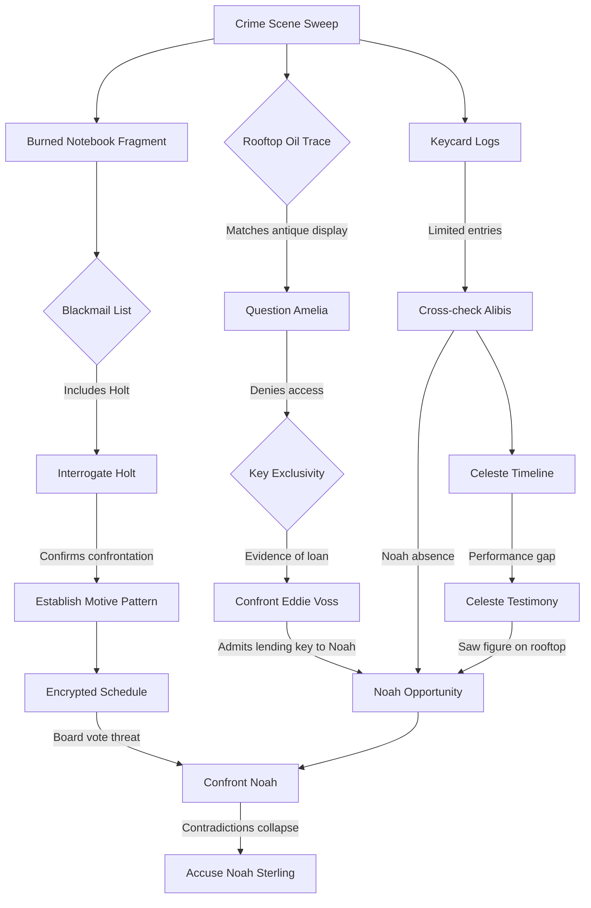

# Murder Mystery Story Bible

## Overview
- **Title:** "Echoes in the Atrium"
- **Setting:** The historic Lyric Atrium Hotel, a refurbished 1920s art deco landmark hosting an exclusive tech-retro gala.
- **Victim:** Julian Mercer, charismatic venture capitalist behind the controversial "Panopticon" surveillance startup.
- **Crime:** Mercer is found dead in the hotel’s rooftop observatory at 11:40 p.m., bludgeoned by an antique telescope mount. Power was cut between 11:15–11:30 p.m., giving cover for the murderer. Stormy weather delayed police arrival, allowing suspects time to coordinate alibis.
- **Themes:** Privacy vs. control, the cost of ambition, loyalty under pressure, and the ethics of innovation.

## Investigation Checkpoints & Key Revelations
1. **Crime Scene Sweep (Rooftop Observatory)**
   - Find the smashed telescope mount with traces of rare antique oil.
   - Discover Mercer's burned notebook page in the incinerator (partial threat list).
   - Collect rooftop keycard reader logs (only four accesses after 10 p.m.).

2. **Power Outage Reconstruction (Maintenance Level)**
   - Determine outage was manual: breaker pulled from inside maintenance room.
   - Note maintenance room access requires physical key held by head engineer only.
   - Identify improvised lockpick marks on maintenance door.

3. **Victim's Schedule & Motives (Hotel Library)**
   - Recover Mercer's encrypted schedule; learn he planned to cancel a lucrative deal.
   - Find NDA draft implicating someone in intellectual property theft.
   - Spot a personal note hinting at secret affair with a gala performer.

4. **Alibi Cross-Check (Ballroom & Private Suites)**
   - Track each suspect’s whereabouts during outage.
   - Surface contradictions between personal timelines and CCTV gaps.
   - Uncover witness testimony about an argument near the freight elevator.

5. **Secret Revelations (Interrogation Room)**
   - Break each suspect’s deception threshold to expose hidden connections to Mercer.
   - Combine secrets to deduce the murderer’s method and motive.
   - Present confrontation with physical evidence + motive + opportunity triangle.

## Core Characters

### Detective Team
- **Lead Detective (Player Character):** Tenacious, methodical, scored on speed/accuracy/legality.
- **Partner: Detective Lila Chen**
  - *Personality:* Pragmatic, tech-savvy, calm under pressure with dry humor.
  - *Hidden Burden:* Internal Affairs monitor; must balance loyalty and protocol.
  - *Role:* Provides hints, legal boundaries, and context on evidence authenticity.

### Primary Suspects

1. **Amelia Reyes – Head Engineer**
   - *Personality:* Precise, prideful, loyal to hotel heritage, dislikes Mercer’s modernization plans.
   - *Public Story:* Working in the ballroom server room during outage.
   - *Secret:* She discovered Mercer intended to sell the hotel to a developer; sabotaged power to search his suite for proof.
   - *Connection to Crime:* Holds keys to maintenance; claims key never left her possession.
   - *Hidden Truth:* She lent her key to her protégé earlier; fears losing job if exposed.

2. **Noah Sterling – Startup Co-Founder**
   - *Personality:* Charismatic, opportunistic, subtly resentful of Mercer’s controlling nature.
   - *Public Story:* Onstage giving keynote demo when outage hit.
   - *Secret:* Embezzled funds to cover gambling debts; Mercer found out and planned to oust him.
   - *Connection to Crime:* Encrypted schedule reveals Mercer called surprise board vote.
   - *Hidden Truth:* Noah slipped away during blackout via backstage corridors; smear of antique oil on cuff links links him to rooftop.

3. **Celeste Ward – Jazz Vocalist & Mercer's Lover**
   - *Personality:* Magnetic, emotionally guarded, adept at reading people.
   - *Public Story:* Performing in speakeasy lounge; claims she never left stage area.
   - *Secret:* Mercer promised to dissolve her predatory management contract; Mercer's death leaves her exposed.
   - *Connection to Crime:* Possesses hidden recordings of Mercer admitting illegal surveillance tactics.
   - *Hidden Truth:* She witnessed the killer fleeing but withholds information to avoid scandal.

4. **Gideon Holt – Security Director**
   - *Personality:* Stern, rule-bound, veteran with a black-and-white worldview.
   - *Public Story:* Coordinating evacuation drills due to outage.
   - *Secret:* Running side business selling anonymized guest data from hotel systems.
   - *Connection to Crime:* The incinerated notebook page lists Holt as blackmail target.
   - *Hidden Truth:* He confronted Mercer earlier that night, but left before the murder.

5. **Dr. Mira Kline – Ethicist Consultant**
   - *Personality:* Analytical, idealistic veneer masking ruthlessness when betrayed.
   - *Public Story:* Hosting ethics roundtable in the library during outage.
   - *Secret:* Mercer plagiarized her research; she planned to expose him publicly.
   - *Connection to Crime:* Her notes mention a rendezvous with Mercer at 11:30 p.m.
   - *Hidden Truth:* She orchestrated the anonymous tip that brought press to gala.

### Secondary Characters
- **Eddie Voss – Bartender & Amelia’s Protégé:** Holds borrowed maintenance key; nervous.
- **Priya Shah – Investigative Journalist:** Received Mira’s tip; saw Noah near freight elevator.
- **Marcus Vale – Stage Manager:** Can confirm Noah’s brief absence and Celeste’s performance gaps.

## Secrets & Contradictions to Uncover
- **Amelia’s Key Loan:** Contradicts her claim of exclusive key access; explains lockpick marks.
- **Noah’s Alibi Gap:** Contradicts his onstage claim; antique oil ties him to weapon.
- **Celeste’s Silent Witness:** She saw Noah but hides it; contradiction emerges when confronted with stage timing logs.
- **Holt’s Blackmail Motive:** Contradicts his loyalty stance; notebook fragment reveals leverage.
- **Mira’s Rendezvous:** Contradicts her roundtable alibi; library attendees note she slipped away.

## Culprit & Resolution
- **Murderer:** Noah Sterling.
- **Motive:** Prevent public ousting and loss of fortune; secure control of Panopticon by eliminating Mercer.
- **Method:** During blackout, Noah used borrowed maintenance key (through Amelia’s protégé) to access rooftop, waited for Mercer, bludgeoned him, then attempted to destroy evidence (incinerated notebook). Antique oil from display telescope transferred to his clothing.
- **Critical Contradictions:**
  - Noah’s presence on rooftop despite alibi (oil evidence + Celeste testimony).
  - Maintenance key trail exposing access opportunity.
  - Board vote motive from encrypted schedule.

## Flow Chart of Contradiction Reveal

## Player Success Conditions
- Present combined evidence: key loan, oil residue, Celeste’s testimony, and board vote motive.
- Maintain legal interrogation tactics (no unlawful threats) to keep score high.
- Accuse Noah only after all contradictions are resolved to avoid penalties.
